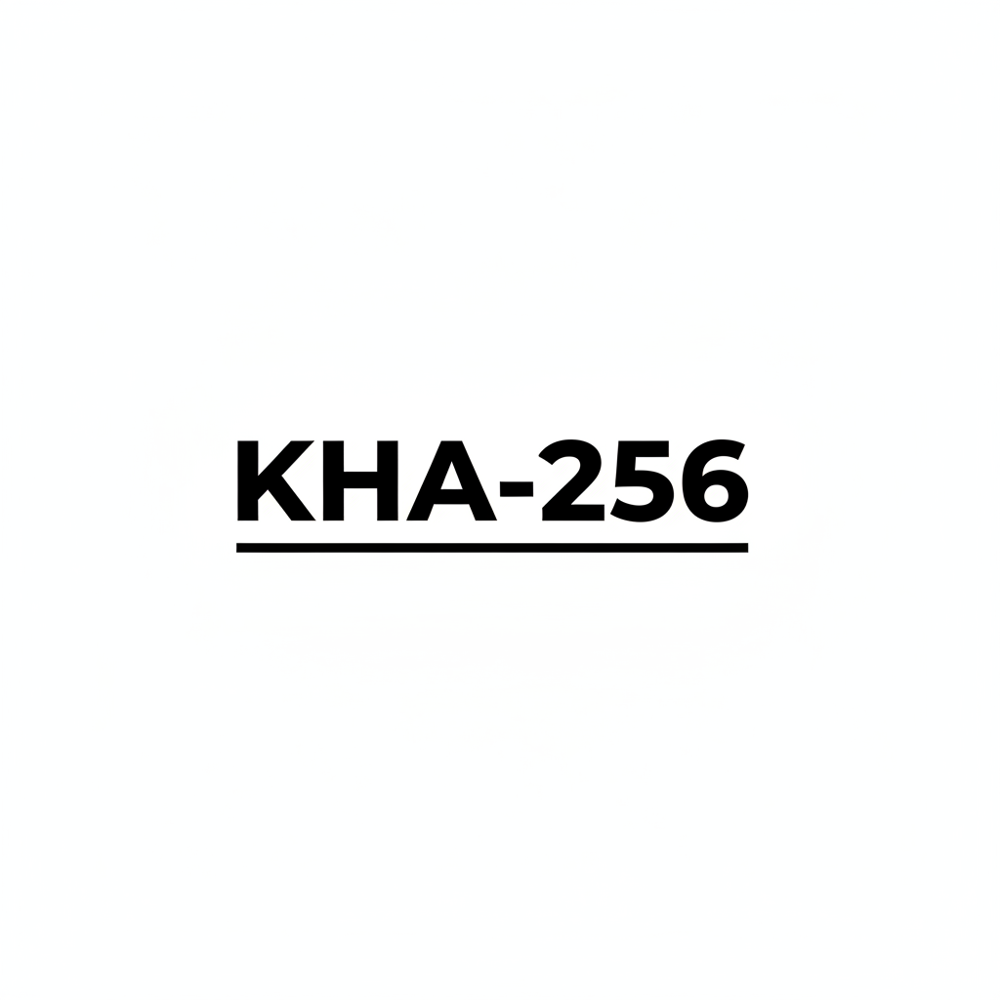

.. KHA-256 documentation master file

==================================
Keçeci Hash Algorithm (KHA-256)
==================================

**Performance-Sacrificed, Security-Maximized Hash Algorithm**

.. toctree::
   :maxdepth: 2
   :caption: Getting Started
   
   quickstart
   installation
   usage

.. toctree::
   :maxdepth: 2
   :caption: API Reference
   
   api/kha256

.. toctree::
   :maxdepth: 2
   :caption: Additional Resources
   
   citation

Overview
========

KHA-256 is a 256-bit cryptographic hash function designed with **security prioritized over performance**. 
It employs advanced mathematical foundations from Keçeci Numbers and provides quantum-resistant features.

Key Features
------------

* **256-bit hash output** (64-character hexadecimal)
* **Strong avalanche effect** (>49.5% in ideal range)
* **Quantum-resistant design** with post-quantum mixing
* **Multiple Keçeci Number types** (22 different mathematical systems)
* **Entropy injection** from time and system sources
* **Double hashing** for additional security layer
* **Configurable security parameters**

Quick Example
-------------

.. code-block:: python

   from kha256 import quick_hash
   
   # Simple hashing
   result = quick_hash("Hello KHA-256!")
   print(f"Hash: {result}")
   
   # Output: 64-character hex string

Security Goals
--------------

.. list-table::
   :header-rows: 1
   :widths: 30 70
   
   * - Property
     - Description
   * - **Collision Resistance**
     - Extremely low probability of hash collisions
   * - **Avalanche Effect**
     - Single bit change affects ~50% of output bits
   * - **Quantum Resistance**
     - Protection against quantum computing attacks
   * - **Entropy Maximization**
     - Multiple entropy sources for unpredictability

Performance Characteristics
---------------------------

KHA-256 is designed for applications where security is paramount and performance is secondary:

* **Speed**: 10-100x slower than SHA-256 (security trade-off)
* **Memory**: 10-50 MB typical usage
* **Parallelism**: Optional parallel processing support
* **Cache**: Smart caching for repeated operations

Use Cases
---------

* **Password storage** with high iteration counts
* **Digital signatures** requiring quantum resistance
* **Blockchain applications** needing strong collision resistance
* **Security-sensitive systems** where performance is secondary
* **Academic research** in cryptographic hash functions

Mathematical Foundation
-----------------------

KHA-256 utilizes **Keçeci Numbers**, a mathematical framework supporting 22 different number types:

1. **Real Numbers** (Positive, Negative, Float)
2. **Complex Numbers** (Standard, Neutrosophic)
3. **Hypercomplex Numbers** (Quaternion, Octonion)
4. **Advanced Types** (Hyperreal, Superreal, Clifford)

Each hash operation combines multiple number types for enhanced entropy.

Getting Help
------------

* **GitHub Issues**: `https://github.com/WhiteSymmetry/kha256/issues`
* **Email**: mehmet@kececi.dev
* **Documentation**: `https://kha256.readthedocs.io`

License
-------

This project is licensed under the **AGPL-3.0 License**. See the LICENSE file for details.

.. note::

   KHA-256 is under active development. Please report any issues or suggestions on GitHub.

Indices and Tables
==================

* :ref:`genindex`
* :ref:`modindex`
* :ref:`search`
